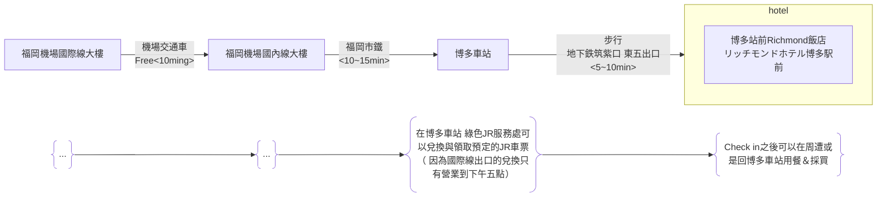

## 2.行程規劃

- [2.行程規劃](#2行程規劃)

---

### 2.1 第一天(2026-01-18 星期日)

**重點**
- 大約19:00福岡機場出關
- 抵達博多車站後 前往JR綠色櫃檯領取JR車票
- 在博多車站可以購買 FUKUOKA TOURIST CITY PASS，這是一種專為外國遊客設計的優惠票券，在福岡市區內無限次搭乘地鐵、公車和部分JR、西鐵電車。
  該票券可在博多車站的旅遊服務中心購買，並附帶多項景點的折扣優惠。
  另外，也有僅限巴士一日遊的「福岡市內1日乘車券」，但FUKUOKA TOURIST CITY PASS整合了更多交通工具的選擇。
  FUKUOKA TOURIST CITY PASS 購買地點：博多車站的旅遊資訊中心或綜合服務處。
  適用範圍：可在有效期間內不限次數搭乘福岡市內的地鐵、JR、西鐵巴士、西鐵電車（部分區段）等。
  票種：
  - 福岡市內版：成人 \(2,500\) 日圓，兒童 \(1,250\) 日圓。
  - 福岡市內+太宰府版：成人 \(2,800\) 日圓，兒童 \(1,400\) 日圓（不含太宰府Liner Bus「旅人」號）。
  優點：除交通外，還能享有部分觀光景點、餐廳和商店的專屬折扣。
  注意：購買時需要出示護照。
  其他票券選擇
  - 福岡市內1日乘車券：
    主要用於西鐵巴士一日無限搭乘，票價為成人 \(1,200\) 日圓。
    在西鐵天神高速、博多、福岡機場總站等處購買。
  - 福岡市地鐵1日乘車券：（**上次旅遊時購買此卷**）
    僅限福岡市地下鐵全線無限搭乘。成人票價為 \(640\) 日圓。 
- 飯店check in之後可返回博多車站美食街晚餐
  - 博多車站晚餐種類：
    - 拉麵： 麵屋兼虎 博多DEITOS店 （沾麵）
    - 牛腸鍋： 元祖牛腸鍋 樂天地 友都八喜博多站店 （在住宿附近但是很有名需要這個月先訂位看看）
    - google map 搜尋博多站 站內尋找（博多站大樓有兩到三家百貨公司共構 地下一樓有美食街跟伴手禮店 一樓大廳處也有鐵路便當可以當作買回飯店用餐的選擇 日本的便當都是冷的）

[回到頁首](#2行程規劃)

[回到上層](./index.md)

---

### 2.2 第二天(2026-01-19 星期一)

[回到頁首](#2行程規劃)

[回到上層](./index.md)

---

### 2.3 第三天(2026-01-20 星期二)

[回到頁首](#2行程規劃)

[回到上層](./index.md)

---

### 2.4 第四天(2026-01-21 星期三)

[回到頁首](#2行程規劃)

[回到上層](./index.md)

---

### 2.5 第五天(2026-01-22 星期四)

[回到頁首](#2行程規劃)

[回到上層](./index.md)

---

### 2.6 第六天(2026-01-23 星期五)

[回到頁首](#2行程規劃)

[回到上層](./index.md)

---
