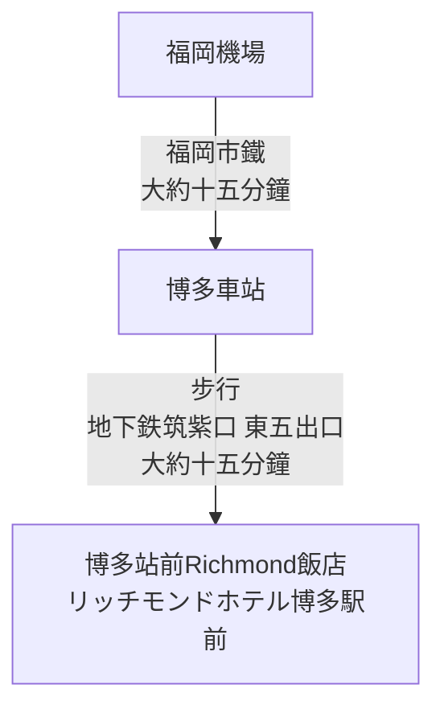

## 2.行程規劃

- [2.行程規劃](#2行程規劃)

---

### 2.1 第一天(2026-01-18 星期日)

**重點**
- 大約19:00福岡機場出關，出關後需要再機場大廳換JRPASS, 福岡Cuty Pass
- 飯店check in之後可返回博多車站美食街晚餐
  - 博多車站晚餐種類：
    - 拉麵： 麵屋兼虎 博多DEITOS店 （沾麵）
    - 牛腸鍋： 元祖牛腸鍋 樂天地 友都八喜博多站店 （在住宿附近但是很有名需要這個月先訂位看看）
    - google map 搜尋博多站 站內尋找（博多站大樓有兩到三家百貨公司共構 地下一樓有美食街跟伴手禮店 一樓大廳處也有鐵路便當可以當作買回飯店用餐的選擇 日本的便當都是冷的）

[回到頁首](#2行程規劃)

[回到上層](./index.md)

---

### 2.2 第二天(2026-01-19 星期一)

[回到頁首](#2行程規劃)

[回到上層](./index.md)

---

### 2.3 第三天(2026-01-20 星期二)

[回到頁首](#2行程規劃)

[回到上層](./index.md)

---

### 2.4 第四天(2026-01-21 星期三)

[回到頁首](#2行程規劃)

[回到上層](./index.md)

---

### 2.5 第五天(2026-01-22 星期四)

[回到頁首](#2行程規劃)

[回到上層](./index.md)

---

### 2.6 第六天(2026-01-23 星期五)

[回到頁首](#2行程規劃)

[回到上層](./index.md)

---
