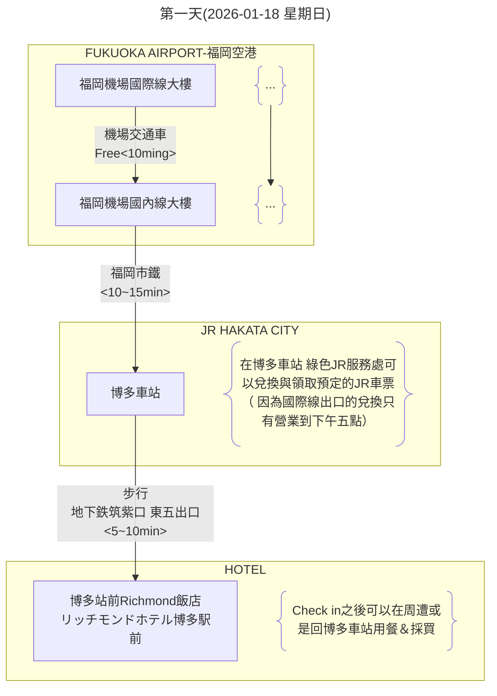
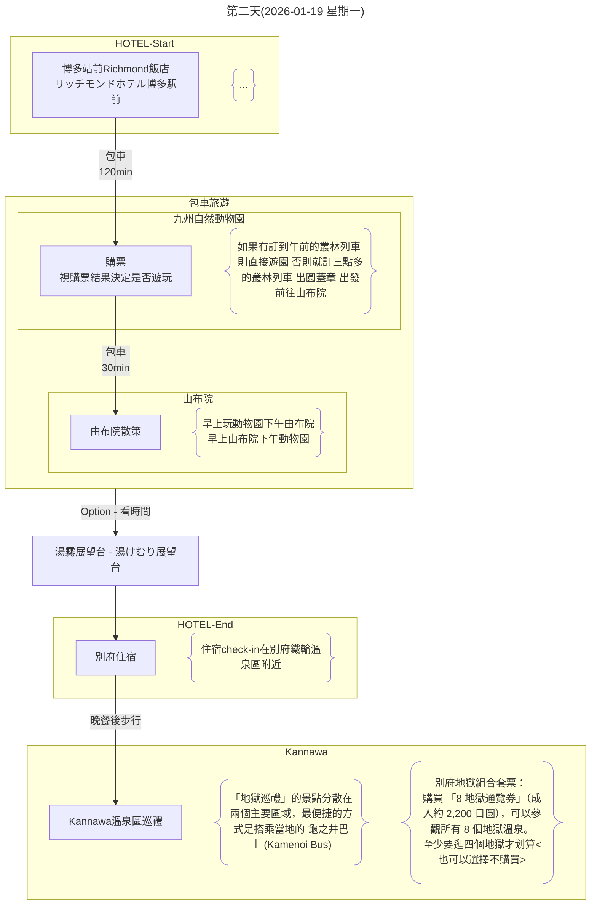
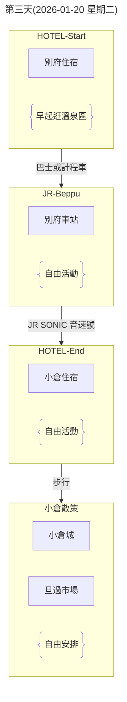
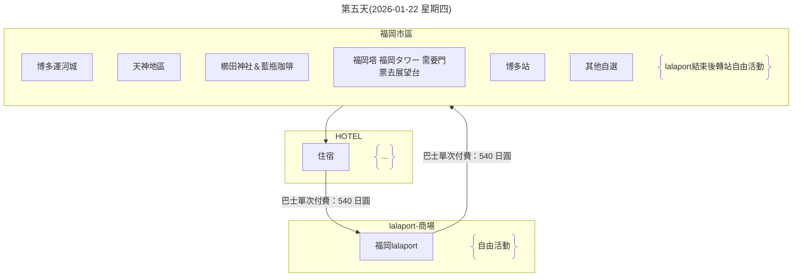

## 2.行程規劃

- [2.行程規劃](#2行程規劃)
  - [2.1 第一天(2026-01-18 星期日)](#21-第一天2026-01-18-星期日)
  - [2.2 第二天(2026-01-19 星期一)](#22-第二天2026-01-19-星期一)
  - [2.3 第三天(2026-01-20 星期二)](#23-第三天2026-01-20-星期二)
  - [2.4 第四天(2026-01-21 星期三)](#24-第四天2026-01-21-星期三)
  - [2.5 第五天(2026-01-22 星期四)](#25-第五天2026-01-22-星期四)
  - [2.6 第六天(2026-01-23 星期五)](#26-第六天2026-01-23-星期五)

[回到上層](./index.md)

---

***目前的行程規劃 尚未根據是否買JRPASS做優化調整***
**福岡市區的行程可以調整次序或調整安排**

### 2.1 第一天(2026-01-18 星期日)

**重點**
- 大約19:00福岡機場出關
- 抵達博多車站後 前往JR綠色櫃檯領取JR車票（如果有購買使用）
- 在博多車站可以購買 FUKUOKA TOURIST CITY PASS，這是一種專為外國遊客設計的優惠票券，在福岡市區內無限次搭乘地鐵、公車和部分JR、西鐵電車。
  該票券可在博多車站的旅遊服務中心購買，並附帶多項景點的折扣優惠。
  另外，也有僅限巴士一日遊的「福岡市內1日乘車券」，但FUKUOKA TOURIST CITY PASS整合了更多交通工具的選擇。
  FUKUOKA TOURIST CITY PASS 購買地點：博多車站的旅遊資訊中心或綜合服務處。
  適用範圍：可在有效期間內不限次數搭乘福岡市內的地鐵、JR、西鐵巴士、西鐵電車（部分區段）等。
  票種：
  - 福岡市內版：成人 \(2,500\) 日圓，兒童 \(1,250\) 日圓。
  - 福岡市內+太宰府版：成人 \(2,800\) 日圓，兒童 \(1,400\) 日圓（不含太宰府Liner Bus「旅人」號）。
  優點：除交通外，還能享有部分觀光景點、餐廳和商店的專屬折扣。
  注意：購買時需要出示護照。
  其他票券選擇
  - 福岡市內1日乘車券：
    主要用於西鐵巴士一日無限搭乘，票價為成人 \(1,200\) 日圓。
    在西鐵天神高速、博多、福岡機場總站等處購買。
  - 福岡市地鐵1日乘車券：（**上次旅遊時購買此卷**）
    僅限福岡市地下鐵全線無限搭乘。成人票價為 \(640\) 日圓。 
- 飯店check in之後可返回博多車站美食街晚餐
  - 博多車站晚餐種類：
    - 拉麵： 麵屋兼虎 博多DEITOS店（沾麵）
    - 牛腸鍋： 元祖牛腸鍋 樂天地 友都八喜博多站店 （在住宿附近但是很有名需要這個月先訂位看看）
    - google map 搜尋博多站 站內尋找（博多站大樓有兩到三家百貨公司共構 地下一樓有美食街跟伴手禮店 一樓大廳處也有鐵路便當可以當作買回飯店用餐的選擇 日本的便當都是冷的）

[回到頁首](#2行程規劃)

[回到上層](./index.md)

---

### 2.2 第二天(2026-01-19 星期一)

**重點**
- 早上一早最晚七點從博多旅館出發 早餐最好前一晚在博多車站買好
- 早上需要在八點半抵達動物園 才比較能夠買到早上的叢林巴士票
- 鐵輪溫泉區的一大特色是溫泉湯煙（蒸氣）。晚上在路燈的照射下，蒸氣裊裊上升的景象會營造出非常獨特的氛圍，是白天看不到的夢幻夜景。
  湯煙展望台（湯けむり展望台）： 營業時間至 21:00。如果能趕在它關閉前（例如晚上七點多）抵達，可以從高處眺望整個鐵輪溫泉區的夜間湯煙景觀。
  但是這地點大眾交通不便 所以看時間列為Option

[回到頁首](#2行程規劃)

[回到上層](./index.md)

---

### 2.3 第三天(2026-01-20 星期二)

**重點**
- 小倉城是福岡縣唯一擁有天守閣的歷史名城，也是日本唯一全年開放至夜間的城堡，更是北九州市的知名地標，自 JR 小倉站步行約10分鐘即可抵達。
- 旦過市場還有許多適合邊走邊吃的美食，到這裡千萬別錯過福岡的傳統美食：米糠味噌燉鯖魚（ぬかみそだき）
- 魚町銀天街全長約130公尺，商店街匯集約138間店鋪，涵蓋美食餐廳、藥妝店、服飾精品、生活雜貨等各類商家，應有盡有。自 JR「小倉」站步行僅需約3分鐘，交通便利，即使遇到雨天也能自在逛街
- 小小倉中央商店街位於 JR 小倉站出口南側，鄰近小倉城及北九州市漫畫博物館，交通便利。從 JR 小倉站一路延伸並連接魚町銀天街，小倉中央商店街同樣設有屋簷，雨天旅行也不掃興。
- AMU PLAZA 小倉緊鄰 JR 小倉站，地理位置絕佳，分為東、西館，集結服飾、美妝、生活雜貨及美食街等店鋪。東館一樓的「小倉站三十步橫丁」（小倉宿駅から三十歩横丁）美食街，更是集結八間特色九州美食，頂樓設有觀景區與空中庭園，可遠眺城市景觀，也是觀賞夜景的好地點之一。
- SAINTcity Shopping Mall 距離 JR 小倉站步行約1分鐘，是集合服飾、生活雜貨、電器商品、咖啡廳與餐廳的14層樓購物中心。館內有許多台灣的人氣品牌：UNIQLO、GU、Loft、無印良品等
- 小倉城庭園是位於小倉城旁的傳統日式庭園，展現江戶時代庭園風格。
- SORA LAND 平尾台是位於平尾台地區的戶外冒險樂園 ，能在廣大草皮中盡情奔跑外，還有空中滑索、攀爬挑戰及草地溜滑梯等各項遊具，非常適合親子家庭一同挑戰。園內也設有RV-Park及露營區，並提供陶藝、製作蕎麥麵、木工等體驗課程 ，半日遊或一日遊都是非常好的選擇。
- 千佛鍾乳洞是一座歷史悠久的鍾乳洞，並於1935年指定為國家天然紀念物。全長約900公尺的步道，設有電燈照明，沿途可欣賞各式鐘乳石奇景，入口處起約480公尺的「奧之細道」（奥の細道）開始，需涉水而入（免費提供草鞋），腳踩清澈水流與巨大石灰岩而行，神秘氛圍令人陶醉。由於不需裝備也能輕鬆體驗地下世界的神秘，因此小孩與長者也可一同造訪
- 門司港是北九州代表性的觀光地，以大正與昭和初期的建築為特色，融合歷史與港町風情。漫步於紅磚街道，穿梭在西洋建築裡、欣賞關門海峽的海景、體驗鐵道、咖啡館交織的懷舊魅力。區內設有遊覽船、復古火車及腳踏車租借等
- 其他時間為自由活動時間
- 小倉美食:
  - 鰻料理 田舎庵 小倉本店
  - 資先生烏龍麵 魚町店
  - 奶油小蛋糕 SHIROYA 小倉店
  - 旦過烏龍麵
  - 平價天婦羅定食 FUJISHIMA
- 網友排的一日遊：JR 小倉站 → 小倉城→ 小倉城庭園 → 旦過市場 →【午餐】旦過烏龍麵 → 魚町銀天街 → 小倉中央商店街 → 門司港 →【晚餐】鰻魚 田舍庵 → JR 小倉站
- 也可以由小倉搭ＪＲ去2022年開幕的北九州outlet + 北九州市立自然歷史博物館(看恐龍) + Space LABO (Kitakyushu City Science Museum)北九州科學館 建議先逛館在逛outlet, 不然沒力氣逛博物罐

[回到頁首](#2行程規劃)

[回到上層](./index.md)

---

### 2.4 第四天(2026-01-21 星期三)

**重點**
- 自由活動日
- 熊本城？

[回到頁首](#2行程規劃)

[回到上層](./index.md)

---

### 2.5 第五天(2026-01-22 星期四)

**重點**
- 本日為市區觀光行程
- lalaport之後的行程依照喜好自行安排（應該是在中午餐後）

**額外資訊：**
- LaLaport 鋼彈立像：
  - 啟動表演 (白天)：10:00 開始，每個整點會有一次簡單的動作表演。
  - 燈光秀/影像秀 (夜晚)：19:00 開始，每隔 30 分鐘會有一次搭配燈光特效的特別演出。
- 博多運河城 水舞秀 (Canal Aqua Panorama)：
  - 白天：10:00~17:30，整點為音樂水舞秀，半點為純水舞秀。
  - 夜晚：18:00~22:00，整點和半點皆為音樂水舞秀，並結合光雕投影。
  - 鋼彈水舞秀：通常在 20:30 左右，一天僅一場 10 分鐘的結合鋼彈主題的特別表演。

[回到頁首](#2行程規劃)

[回到上層](./index.md)

---

### 2.6 第六天(2026-01-23 星期五)

**重點**
- 睡醒退房後的悠閒行程
- 下午五點前需要抵達福岡機場國際線大廳報到登機

[回到頁首](#2行程規劃)

[回到上層](./index.md)

---

