<meta name="viewport" content="width=device-width, initial-scale=1">

## 2.行程規劃

- [2.行程規劃](#2行程規劃)
  - [2.1 第一天(2026-01-18 星期日)](#21-第一天2026-01-18-星期日)
  - [2.2 第二天(2026-01-19 星期一)](#22-第二天2026-01-19-星期一)
  - [2.3 第三天(2026-01-20 星期二)](#23-第三天2026-01-20-星期二)
  - [2.4 第四天(2026-01-21 星期三)](#24-第四天2026-01-21-星期三)
  - [2.5 第五天(2026-01-22 星期四)](#25-第五天2026-01-22-星期四)
  - [2.6 第六天(2026-01-23 星期五)](#26-第六天2026-01-23-星期五)
  - [2.7 交通費用分析](#27-交通費用分析)

[回到上層](./index.md)

---

***目前的行程規劃 尚未根據是否買JRPASS做優化調整***
**福岡市區的行程可以調整次序或調整安排**

### 2.1 第一天(2026-01-18 星期日)

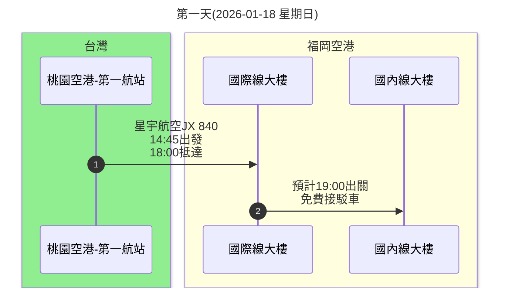

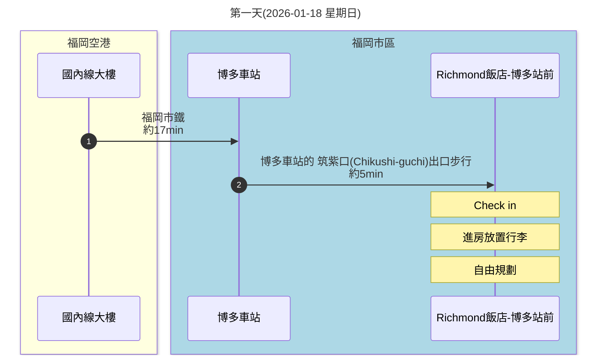

---

**Google Map 交通路線圖**

<iframe src="https://www.google.com/maps/embed?pb=!1m28!1m12!1m3!1d7074915.392954283!2d124.63751114737596!3d30.02111727134806!2m3!1f0!2f0!3f0!3m2!1i1024!2i768!4f13.1!4m13!3e4!4m5!1s0x34429fc062d215d5%3A0x70a3b690a9b5b109!2z5qGD5ZyS5biC5aSn5ZyS5Y2A6Iiq56uZ5Y2X6Lev6Ie654Gj5qGD5ZyS5ZyL6Zqb5qmf5aC0IChUUEUp!3m2!1d25.0804884!2d121.2311579!4m5!1s0x35419016426901ad%3A0x16e67f46584e1fb7!2z56aP5bKh5ZyL6Zqb5qmf5aC0IChGVUspNzc4LTEgU2hpbW91c3VpLCBIYWthdGEgV2FyZCwgRnVrdW9rYSwgODEyLTAwMDPml6XmnKw!3m2!1d33.5849988!2d130.4490906!5e0!3m2!1szh-TW!2stw!4v1765351365874!5m2!1szh-TW!2stw" width="600" height="450" style="border:0;" allowfullscreen="" loading="lazy" referrerpolicy="no-referrer-when-downgrade"></iframe>

<iframe src="https://www.google.com/maps/embed?pb=!1m28!1m12!1m3!1d13293.851787676915!2d130.424970607463!3d33.593290785962466!2m3!1f0!2f0!3f0!3m2!1i1024!2i768!4f13.1!4m13!3e3!4m5!1s0x35419016426901ad%3A0x16e67f46584e1fb7!2z56aP5bKh5ZyL6Zqb5qmf5aC0IChGVUspNzc4LTEgU2hpbW91c3VpLCBIYWthdGEgV2FyZCwgRnVrdW9rYSwgODEyLTAwMDPml6XmnKw!3m2!1d33.5849988!2d130.4490906!4m5!1s0x354191b7e5f00001%3A0x4985fc1e78aecb1e!2z5pel5pys56aP5bKh57ij56aP5bKh5biC5Y2a5aSa5Y2AIEhha2F0YWVraWNoxavFjWdhaSwgNuKIkjE3IOWNmuWkmuermeWJjVJpY2htb25k6aOv5bqX!3m2!1d33.5880791!2d130.4221093!5e0!3m2!1szh-TW!2stw!4v1765351851203!5m2!1szh-TW!2stw" width="600" height="450" style="border:0;" allowfullscreen="" loading="lazy" referrerpolicy="no-referrer-when-downgrade"></iframe>

---

**重點**
- 博多車站
  - 兌換JRPASS(如果有購買)
  - 兌換FUKUOKA TOURIST CITY PASS或福岡市內1日乘車券或是其他套票(如果有購買)
    - 博多車站的旅遊資訊中心或綜合服務處
    - FUKUOKA TOURIST CITY PASS:
      這是一種專為外國遊客設計的優惠票券，在福岡市區內無限次搭乘地鐵、公車和部分JR、西鐵電車。  該票券可在博多車站的旅遊服務中心購買，並附帶多項景點的折扣優惠。
      適用範圍：可在有效期間內不限次數搭乘福岡市內的地鐵、JR、西鐵巴士、西鐵電車（部分區段）等。
      福岡市內版：成人 \(2,500\) 日圓，兒童 \(1,250\) 日圓。
      注意：購買時需要出示護照。
    - 福岡市內1日乘車券:
      主要用於西鐵巴士一日無限搭乘，票價為成人 \(1,200\) 日圓。
      在西鐵天神高速、博多、福岡機場總站等處購買。
    - 福岡市地鐵1日乘車券:
      僅限福岡市地下鐵全線無限搭乘。成人票價為 \(640\) 日圓。 
  - 可以在博多車站買鐵路便當回飯店吃晚餐或是飯店放置行李後來博多車站吃拉麵(麵屋兼虎博多DEITOS店-沾麵)
- 旅館周邊:
    - 牛腸鍋： 元祖牛腸鍋 樂天地 友都八喜博多站店 （在住宿附近但是很有名需要這個月先訂位看看）

[回到頁首](#2行程規劃)

[回到上層](./index.md)

---

### 2.2 第二天(2026-01-19 星期一)

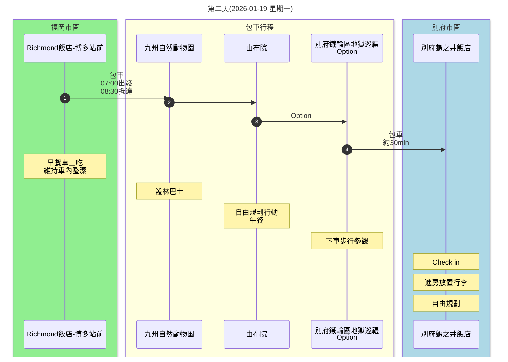

---

**Google Map 交通路線圖**

<iframe src="https://www.google.com/maps/embed?pb=!1m46!1m12!1m3!1d425872.39010864194!2d130.79328085031548!3d33.498045508127106!2m3!1f0!2f0!3f0!3m2!1i1024!2i768!4f13.1!4m31!3e0!4m5!1s0x354191b7e5f00001%3A0x4985fc1e78aecb1e!2z5pel5pys56aP5bKh57ij56aP5bKh5biC5Y2a5aSa5Y2AIEhha2F0YWVraWNoxavFjWdhaSwgNuKIkjE3IOWNmuWkmuermeWJjVJpY2htb25k6aOv5bqX!3m2!1d33.5880791!2d130.4221093!4m5!1s0x3546a922d4029bd1%3A0xb195eec6ff51740a!2z5pel5pys5aSn5YiG57ij5a6H5L2Q5biCIEFqaW11bWFjaGkgTWluYW1paGF0YSwg5Lmd5bee6Ieq54S25YuV54mp5YWs5ZyS!3m2!1d33.350207499999996!2d131.4150208!4m5!1s0x3546ad124d94a733%3A0xdfcd3644dc34617a!2z5pel5pys5aSn5YiG57ij55Sx5biD5biCIFl1ZnVpbmNobyBLYXdha2l0YSwg55Sx5biD6Zmi6LuK56uZ5YGc6LuK5aC0!3m2!1d33.2630891!2d131.3549916!4m5!1s0x3546a72953266c13%3A0x266b87ec7bdca4e4!2z5pel5pys5aSn5YiG57ij5Yil5bqc5biCIE5vZGEsIOihgOOBruaxoOWcsOeNhCDnhKHmlpnpp5Dou4rloLQ!3m2!1d33.3272748!2d131.4788604!4m5!1s0x3546a6e9bc2e79c3%3A0xf23c3814d720b79!2z5pel5pys5aSn5YiG57ij5Yil5bqc5biCIENodW9tYWNoaSwgNSDliKXlupwg6b6c5LmL5LqV6aOv5bqX!3m2!1d33.276461999999995!2d131.499686!5e0!3m2!1szh-TW!2stw!4v1765351973321!5m2!1szh-TW!2stw" width="600" height="450" style="border:0;" allowfullscreen="" loading="lazy" referrerpolicy="no-referrer-when-downgrade"></iframe>

---

**重點**
- 早上一早最晚七點從博多旅館出發 早餐最好前一晚在博多車站買好
- 早上需要在八點半抵達動物園排隊買票 才比較能夠買到早上的叢林巴士票
- 若時間許可，包車可增加景點：**別府鐵輪區地獄巡禮**
  - 鐵輪溫泉區的一大特色是溫泉湯煙（蒸氣）。晚上在路燈的照射下，蒸氣裊裊上升的景象會營造出非常獨特的氛圍，**是白天看不到的夢幻夜景。**
  - 若今日因時間緣故無法安排地獄巡禮，隔日早上搭乘當地的 龜之井巴士 (Kamenoi Bus)，或計程車參觀
  - [福寶媽 -由布院](https://gogojp.tw/2017-01-30-237/)

[回到頁首](#2行程規劃)

[回到上層](./index.md)

---

### 2.3 第三天(2026-01-20 星期二)

**前一天沒有去地獄巡禮:**

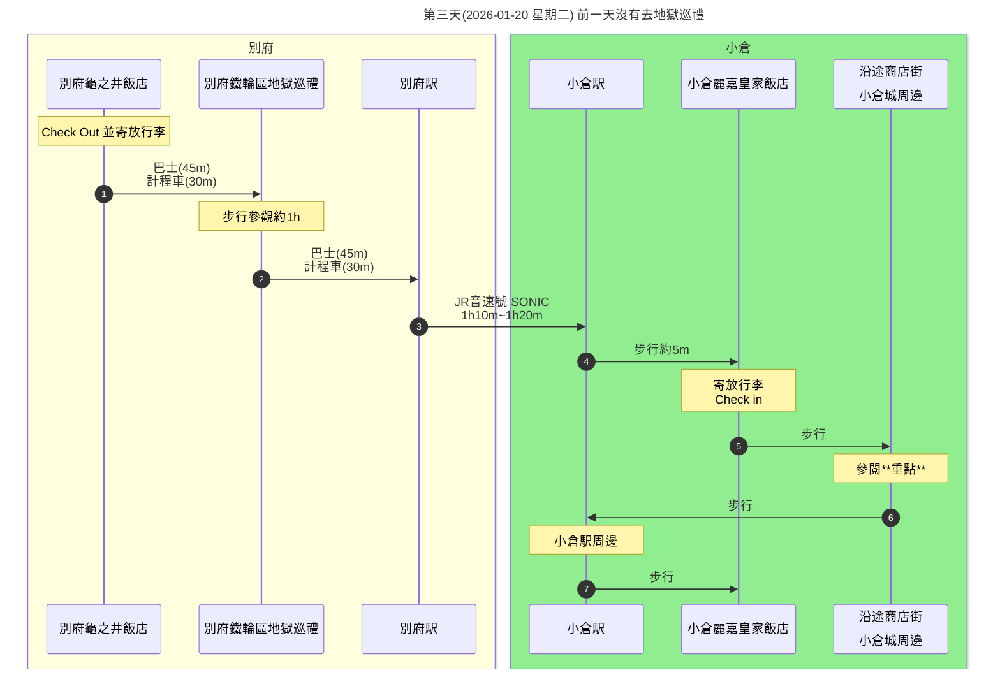

**前一天已經完成地獄巡禮:**

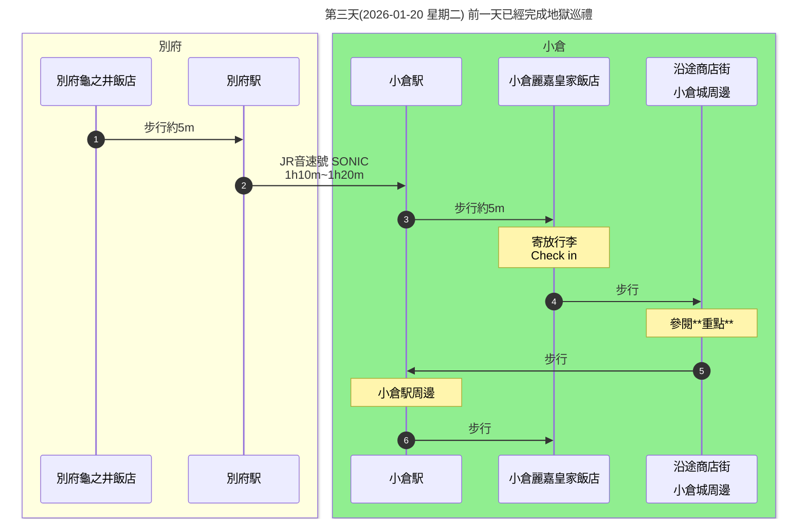

---

**Google Map 交通路線示意圖**

<iframe src="https://www.google.com/maps/embed?pb=!1m64!1m12!1m3!1d425453.67699566926!2d130.8581950840312!3d33.583065794536964!2m3!1f0!2f0!3f0!3m2!1i1024!2i768!4f13.1!4m49!3e0!4m5!1s0x3546a6e9bc2e79c3%3A0xf23c3814d720b79!2z6b6c5LmL5LqV6YWS5bqXIOWIq-W6nA!3m2!1d33.276461999999995!2d131.499686!4m5!1s0x3546a72953266c13%3A0x266b87ec7bdca4e4!2z6KGA5rGg5Zyw542EIOWBnOi7iuWgtA!3m2!1d33.3272748!2d131.4788604!4m5!1s0x3546a6e7e0284e93%3A0xbd6c35908b679702!2z5Yil5bqc56uZ!3m2!1d33.2797011!2d131.5002568!4m5!1s0x3543bf4c1b6f2f3f%3A0xc17cb4fd9abaed0d!2z5bCP5YCJ56uZ!3m2!1d33.88607!2d130.88254999999998!4m5!1s0x3543bf4d0622290b%3A0x3cc115df92d941f8!2z6a2a55S66YqA5aSp6KGX!3m2!1d33.8841641!2d130.8800183!4m5!1s0x3543bf52e5a04e5f%3A0xfefdb0c98463ffe9!2z5pem6YGO5biC5aC0!3m2!1d33.8813113!2d130.87946309999998!4m5!1s0x3543b8ad94500c23%3A0x1307eedef77d6d68!2z5bCP5YCJ5Z-O!3m2!1d33.8844357!2d130.8742541!4m5!1s0x3543bf490829bddd%3A0x7902eaf5e6f9493a!2z5pel5pys56aP5bKh57ij5YyX5Lmd5bee5biC5bCP5YCJ5YyX5Y2AIEFzYW5vLCAyIENob21l4oiSMTTiiJIyIOWwj-WAiem6l-WYieeah-WutumFkuW6lw!3m2!1d33.888163!2d130.8850861!5e0!3m2!1szh-TW!2stw!4v1765352442368!5m2!1szh-TW!2stw" width="600" height="450" style="border:0;" allowfullscreen="" loading="lazy" referrerpolicy="no-referrer-when-downgrade"></iframe>

---

**重點**
- 前一晚沒有去別府地獄巡禮的話則改為今天一早前往
- 小倉駅周邊
  - AMU PLAZA 小倉
    緊鄰 JR 小倉站，地理位置絕佳，分為東、西館，集結服飾、美妝、生活雜貨及美食街等店鋪。東館一樓的「小倉站三十步橫丁」（小倉宿駅から三十歩横丁）美食街，更是集結八間特色九州美食，頂樓設有觀景區與空中庭園，可遠眺城市景觀，也是觀賞夜景的好地點之一。
  - SAINTcity Shopping Mall 
    距離 JR 小倉站步行約1分鐘，是集合服飾、生活雜貨、電器商品、咖啡廳與餐廳的14層樓購物中心。館內有許多台灣的人氣品牌：UNIQLO、GU、Loft、無印良品等
- 沿途商店街
  - 小倉中央商店街
    位於 JR 小倉站出口南側，鄰近小倉城及北九州市漫畫博物館，交通便利。從 JR 小倉站一路延伸並連接魚町銀天街，小倉中央商店街同樣設有屋簷，雨天旅行也不掃興。
  - 魚町銀天街
    全長約130公尺，商店街匯集約138間店鋪，涵蓋美食餐廳、藥妝店、服飾精品、生活雜貨等各類商家，應有盡有。自 JR「小倉」站步行僅需約3分鐘，交通便利，即使遇到雨天也能自在逛街
  - 旦過市場
    有許多適合邊走邊吃的美食，到這裡千萬別錯過福岡的傳統美食：米糠味噌燉鯖魚（ぬかみそだき）
- 小倉城周邊
  - 小倉城
    是福岡縣唯一擁有天守閣的歷史名城，也是日本唯一全年開放至夜間的城堡，更是北九州市的知名地標，自 JR 小倉站步行約10分鐘即可抵達。
  - 小倉城庭園
    是位於小倉城旁的傳統日式庭園，展現江戶時代庭園風格。
  - 松本清張紀念館
  - 小倉祇園 八坂神社
  - 北九州河畔步行街
- 小倉美食:
  - 鰻料理 田舎庵 小倉本店
  - 資先生烏龍麵 魚町店
  - 奶油小蛋糕 SHIROYA 小倉店
  - 旦過烏龍麵
  - 平價天婦羅定食 FUJISHIMA
- [福寶媽 -小倉](https://gogojp.tw/kokura-trip/)

[回到頁首](#2行程規劃)

[回到上層](./index.md)

---

### 2.4 第四天(2026-01-21 星期三)

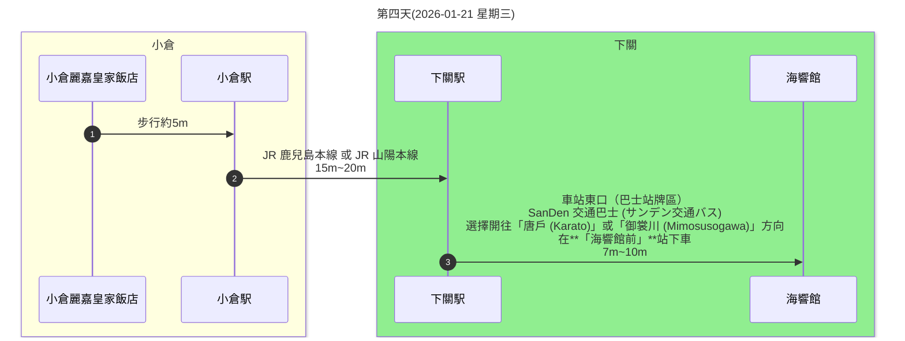

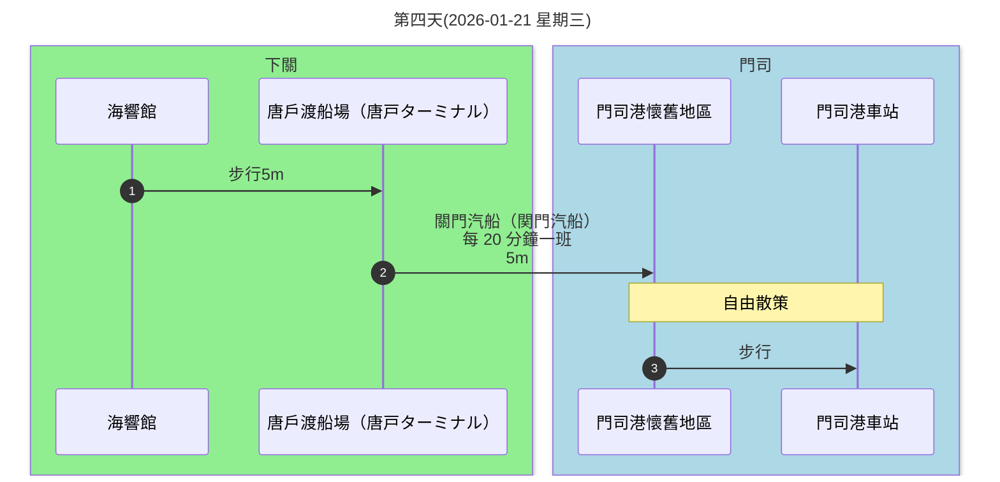

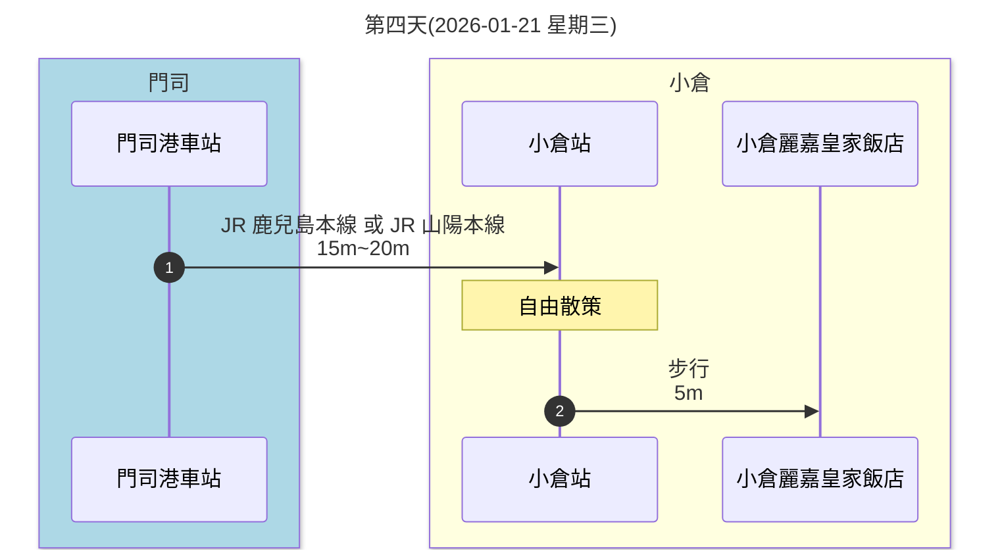

---

**Google Map 交通路線示意圖**

小倉到海響館:
<iframe src="https://www.google.com/maps/embed?pb=!1m28!1m12!1m3!1d13239.538575273644!2d130.92906090389147!3d33.94409495221324!2m3!1f0!2f0!3f0!3m2!1i1024!2i768!4f13.1!4m13!3e3!4m5!1s0x3543bf4c1b6f2f3f%3A0xc17cb4fd9abaed0d!2z5pel5pys56aP5bKh57ij5YyX5Lmd5bee5biC5bCP5YCJ5YyX5Y2AIEFzYW5vLCAxIENob21l4oiSMSwg5bCP5YCJ56uZ!3m2!1d33.88607!2d130.88254999999998!4m5!1s0x3543bd996b2366d9%3A0xdc06d7e1c49219fa!2z5pel5pys5bGx5Y-j57ij5LiL6Zec5biCIEFyY2Fwb3J0LCA2IO-8lueVqjHlj7cg5rW36Z-_6aSo!3m2!1d33.9546189!2d130.9423611!5e0!3m2!1szh-TW!2stw!4v1765352590568!5m2!1szh-TW!2stw" width="600" height="450" style="border:0;" allowfullscreen="" loading="lazy" referrerpolicy="no-referrer-when-downgrade"></iframe>

海響館到門司港:
<iframe src="https://www.google.com/maps/embed?pb=!1m28!1m12!1m3!1d6619.320737871874!2d130.94730918436485!3d33.949862416677895!2m3!1f0!2f0!3f0!3m2!1i1024!2i768!4f13.1!4m13!3e3!4m5!1s0x3543bd996b2366d9%3A0xdc06d7e1c49219fa!2z5pel5pys5bGx5Y-j57ij5LiL6Zec5biCIEFyY2Fwb3J0LCA2IO-8lueVqjHlj7cg5rW36Z-_6aSo!3m2!1d33.9546189!2d130.9423611!4m5!1s0x354396293e9a6fd9%3A0xf012cc176d8a09b4!2z5pel5pys56aP5bKh57ij5YyX5Lmd5bee5biC6ZaA5Y-45Y2AIE1pbmF0b21hY2hpLCA5IOmWgOWPuOa4r-ODrOODiOODrQ!3m2!1d33.9462036!2d130.9630099!5e0!3m2!1szh-TW!2stw!4v1765352663662!5m2!1szh-TW!2stw" width="600" height="450" style="border:0;" allowfullscreen="" loading="lazy" referrerpolicy="no-referrer-when-downgrade"></iframe>

門司港回小倉:
<iframe src="https://www.google.com/maps/embed?pb=!1m28!1m12!1m3!1d52977.41438238241!2d130.8856108570202!3d33.913124372398336!2m3!1f0!2f0!3f0!3m2!1i1024!2i768!4f13.1!4m13!3e3!4m5!1s0x354396293e9a6fd9%3A0xf012cc176d8a09b4!2z5pel5pys56aP5bKh57ij5YyX5Lmd5bee5biC6ZaA5Y-45Y2AIE1pbmF0b21hY2hpLCA5IOmWgOWPuOa4r-ODrOODiOODrQ!3m2!1d33.9462036!2d130.9630099!4m5!1s0x3543bf4c1b6f2f3f%3A0xc17cb4fd9abaed0d!2z5pel5pys56aP5bKh57ij5YyX5Lmd5bee5biC5bCP5YCJ5YyX5Y2AIEFzYW5vLCAxIENob21l4oiSMSwg5bCP5YCJ56uZ!3m2!1d33.88607!2d130.88254999999998!5e0!3m2!1szh-TW!2stw!4v1765352757797!5m2!1szh-TW!2stw" width="600" height="450" style="border:0;" allowfullscreen="" loading="lazy" referrerpolicy="no-referrer-when-downgrade"></iframe>

---

**重點**
- 自由活動日
- [海響館官網](https://www.kaikyokan.com/)
  - 海響館擁有其他水族館沒有的豐富特色，是一座充滿魅力的水族館。館內有許多特色的展示內容，有重現關門海峽美麗海潮的潮流水缸，及全世界種類最多的河豚展示，包含虎河豚和曼波魚等，在日本規模最大的企鵝展示館「企鵝村」裡，有5種約120隻棲息在南極洲與溫帶兩種氣候區的企鵝。
- [福寶媽-門司港景點](https://gogojp.tw/2017-05-03-414/)
- 

[回到頁首](#2行程規劃)

[回到上層](./index.md)

---

### 2.5 第五天(2026-01-22 星期四)

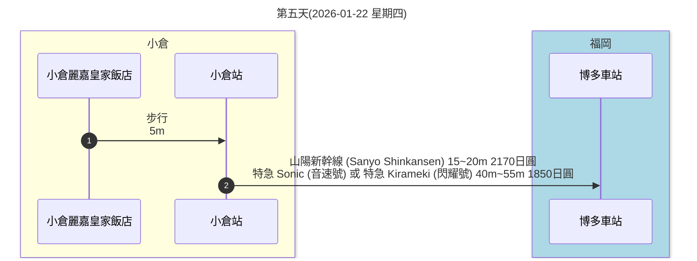

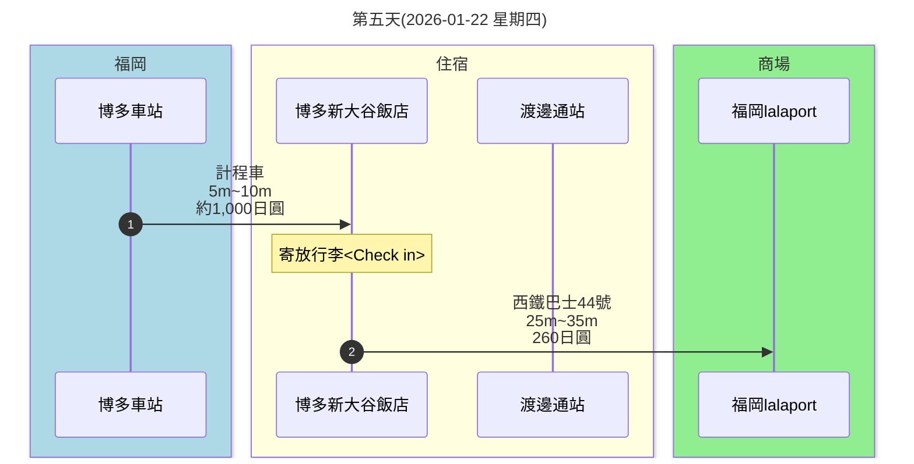

**自由行簡單逛街方案 A**

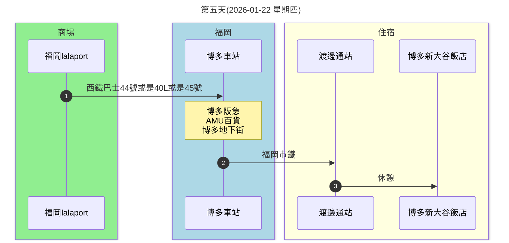

**自由行簡單逛街方案 B**

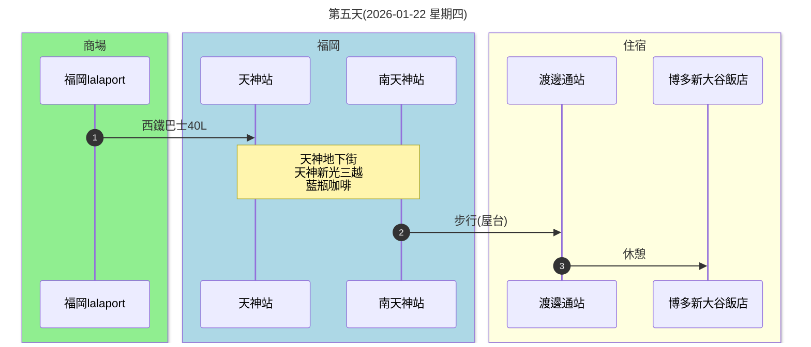

---

**Google Map 交通路線示意圖**

小倉往博多:
<iframe src="https://www.google.com/maps/embed?pb=!1m28!1m12!1m3!1d212205.82950964718!2d130.56786876170804!3d33.793829147722676!2m3!1f0!2f0!3f0!3m2!1i1024!2i768!4f13.1!4m13!3e3!4m5!1s0x3543bf4c1b6f2f3f%3A0xc17cb4fd9abaed0d!2z5pel5pys56aP5bKh57ij5YyX5Lmd5bee5biC5bCP5YCJ5YyX5Y2AIEFzYW5vLCAxIENob21l4oiSMSwg5bCP5YCJ56uZ!3m2!1d33.88607!2d130.88254999999998!4m5!1s0x354191c7e6f9b375%3A0x2ee22b3d45b98b90!2z5pel5pys56aP5bKh57ij56aP5bKh5biC5Y2a5aSa5Y2AIOWNmuWkmumnheS4reWkruihlzEsIOWNmuWkmg!3m2!1d33.589727499999995!2d130.4207274!5e0!3m2!1szh-TW!2stw!4v1765352821809!5m2!1szh-TW!2stw" width="600" height="450" style="border:0;" allowfullscreen="" loading="lazy" referrerpolicy="no-referrer-when-downgrade"></iframe>

博多到博多新大谷飯店:
<iframe src="https://www.google.com/maps/embed?pb=!1m28!1m12!1m3!1d6647.461077105511!2d130.40581029595765!3d33.586344931056054!2m3!1f0!2f0!3f0!3m2!1i1024!2i768!4f13.1!4m13!3e3!4m5!1s0x354191c7e6f9b375%3A0x2ee22b3d45b98b90!2z5pel5pys56aP5bKh57ij56aP5bKh5biC5Y2a5aSa5Y2AIOWNmuWkmumnheS4reWkruihlzEsIOWNmuWkmg!3m2!1d33.589727499999995!2d130.4207274!4m5!1s0x3541919982907677%3A0x7e4ec8d30ce7106f!2z5pel5pys56aP5bKh57ij56aP5bKh5biC5Lit5aSu5Y2AIFdhdGFuYWJlZG9yaSwgMSBDaG9tZeKIkjEgSG90ZWwgTmV3IE90YW5pIEhha2F0YSwg5Y2a5aSa5paw5aSn6LC36aOv5bqX!3m2!1d33.583091599999996!2d130.4063041!5e0!3m2!1szh-TW!2stw!4v1765352961952!5m2!1szh-TW!2stw" width="600" height="450" style="border:0;" allowfullscreen="" loading="lazy" referrerpolicy="no-referrer-when-downgrade"></iframe>

博多新大谷飯店到福岡lalaport:
<iframe src="https://www.google.com/maps/embed?pb=!1m28!1m12!1m3!1d26593.154372773268!2d130.40132543097263!3d33.575602549308755!2m3!1f0!2f0!3f0!3m2!1i1024!2i768!4f13.1!4m13!3e3!4m5!1s0x3541919982907677%3A0x7e4ec8d30ce7106f!2z5pel5pys56aP5bKh57ij56aP5bKh5biC5Lit5aSu5Y2AIFdhdGFuYWJlZG9yaSwgMSBDaG9tZeKIkjEgSG90ZWwgTmV3IE90YW5pIEhha2F0YSwg5Y2a5aSa5paw5aSn6LC36aOv5bqX!3m2!1d33.583091599999996!2d130.4063041!4m5!1s0x354191e79a67d911%3A0xe57737261ee4d100!2z5pel5pys56aP5bKh57ij56aP5bKh5biC5Y2a5aSa5Y2AIE5ha2EsIDYgQ2hvbWXiiJIyM-KIkjEgTGFMYXBvcnQg56aP5bKh!3m2!1d33.565704!2d130.4401153!5e0!3m2!1szh-TW!2stw!4v1765353053336!5m2!1szh-TW!2stw" width="600" height="450" style="border:0;" allowfullscreen="" loading="lazy" referrerpolicy="no-referrer-when-downgrade"></iframe>

福岡lalaport到博多站:
<iframe src="https://www.google.com/maps/embed?pb=!1m28!1m12!1m3!1d13296.066223393533!2d130.42001131644136!3d33.57891940042629!2m3!1f0!2f0!3f0!3m2!1i1024!2i768!4f13.1!4m13!3e3!4m5!1s0x354191e79a67d911%3A0xe57737261ee4d100!2z5pel5pys56aP5bKh57ij56aP5bKh5biC5Y2a5aSa5Y2AIE5ha2EsIDYgQ2hvbWXiiJIyM-KIkjEgTGFMYXBvcnQg56aP5bKh!3m2!1d33.565704!2d130.4401153!4m5!1s0x354191c7e6f9b375%3A0x2ee22b3d45b98b90!2z5pel5pys56aP5bKh57ij56aP5bKh5biC5Y2a5aSa5Y2AIOWNmuWkmumnheS4reWkruihlzEsIOWNmuWkmg!3m2!1d33.589727499999995!2d130.4207274!5e0!3m2!1szh-TW!2stw!4v1765353206308!5m2!1szh-TW!2stw" width="600" height="450" style="border:0;" allowfullscreen="" loading="lazy" referrerpolicy="no-referrer-when-downgrade"></iframe>

福岡lalaport到天神站:
<iframe src="https://www.google.com/maps/embed?pb=!1m28!1m12!1m3!1d26593.391104957856!2d130.40103438097108!3d33.57483414964635!2m3!1f0!2f0!3f0!3m2!1i1024!2i768!4f13.1!4m13!3e3!4m5!1s0x354191e79a67d911%3A0xe57737261ee4d100!2z5pel5pys56aP5bKh57ij56aP5bKh5biC5Y2a5aSa5Y2AIE5ha2EsIDYgQ2hvbWXiiJIyM-KIkjEgTGFMYXBvcnQg56aP5bKh!3m2!1d33.565704!2d130.4401153!4m5!1s0x3541918e44e39077%3A0xe8214e0d1793b30!2z5pel5pysIOemj-WyoeecjOemj-WyoeW4guS4reWkruWMuuWkqeelnu-8kuKIkjEyLCDlpKnnpZ7pp4U!3m2!1d33.5914006!2d130.3988788!5e0!3m2!1szh-TW!2stw!4v1765353261281!5m2!1szh-TW!2stw" width="600" height="450" style="border:0;" allowfullscreen="" loading="lazy" referrerpolicy="no-referrer-when-downgrade"></iframe>

---

**重點**
- [西鐵巴士官網](https://www.nishitetsu.jp/zh_tw/)
- 由於 44 號巴士是一條大路線，上車時務必確認車頭或站牌資訊顯示該班車會開往 「ららぽーと福岡」（LaLaport 福岡）方向，因為部分 44 號的終點站可能不是 LaLaport
- 40L巴士同時也有經過博多運河城

**額外資訊：**
- LaLaport 鋼彈立像：
  - 啟動表演 (白天)：10:00 開始，每個整點會有一次簡單的動作表演。
  - 燈光秀/影像秀 (夜晚)：19:00 開始，每隔 30 分鐘會有一次搭配燈光特效的特別演出。
- 博多運河城 水舞秀 (Canal Aqua Panorama)：
  - 白天：10:00~17:30，整點為音樂水舞秀，半點為純水舞秀。
  - 夜晚：18:00~22:00，整點和半點皆為音樂水舞秀，並結合光雕投影。
  - 鋼彈水舞秀：通常在 20:30 左右，一天僅一場 10 分鐘的結合鋼彈主題的特別表演。
- [網友分享](https://blog.udn.com/whiteho/7458084)

[回到頁首](#2行程規劃)

[回到上層](./index.md)

---

### 2.6 第六天(2026-01-23 星期五)

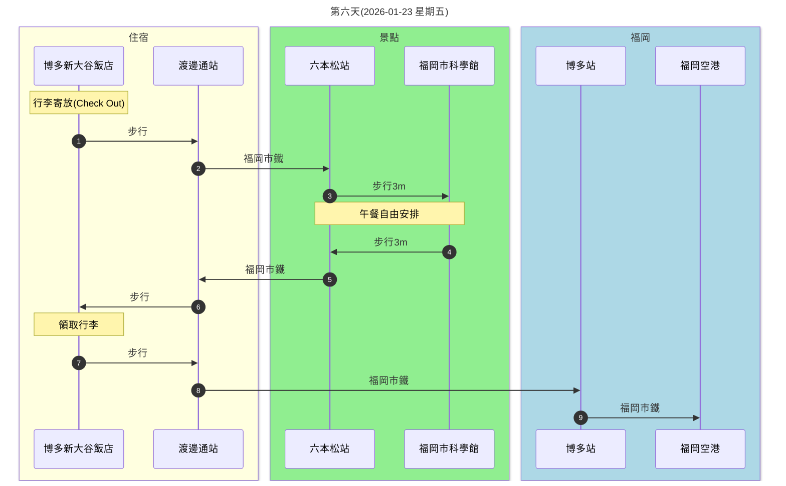

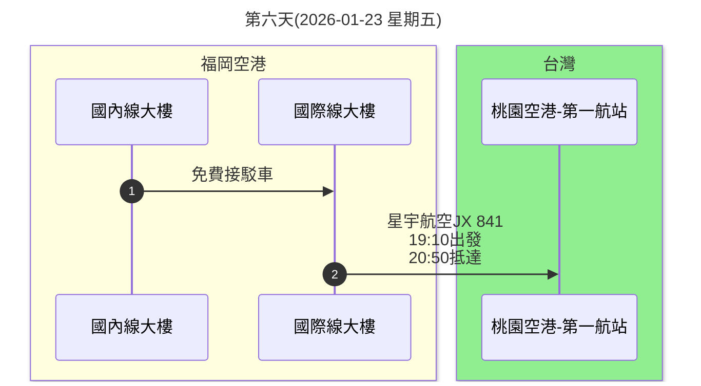
---

**Google Map 交通路線示意圖**

博多新大谷飯店到福岡科學館:
<iframe src="https://www.google.com/maps/embed?pb=!1m28!1m12!1m3!1d13295.828877894028!2d130.38123696644217!3d33.58046000009752!2m3!1f0!2f0!3f0!3m2!1i1024!2i768!4f13.1!4m13!3e3!4m5!1s0x3541919982907677%3A0x7e4ec8d30ce7106f!2z5Y2a5aSa5paw5aSn6LC36aOv5bqXIOaXpeacrOOAkjgxMC0wMDA0IEZ1a3Vva2EsIENodW8gV2FyZCwgV2F0YW5hYmVkb3JpLCAxIENob21l4oiSMeKIkjI!3m2!1d33.583091599999996!2d130.4063041!4m5!1s0x354193a97fdf5f67%3A0x9aaf1979ab16b010!2z5pel5pys56aP5bKh57ij56aP5bKh5biC5Lit5aSu5Y2AIFJvcHBvbm1hdHN1LCA0IENob21l4oiSMuKIkjEg56aP5bKh5biC56eR5a246aSo!3m2!1d33.5774099!2d130.37823129999998!5e0!3m2!1szh-TW!2stw!4v1765353330792!5m2!1szh-TW!2stw" width="600" height="450" style="border:0;" allowfullscreen="" loading="lazy" referrerpolicy="no-referrer-when-downgrade"></iframe>

博多新大谷飯店到福岡城:
<iframe src="https://www.google.com/maps/embed?pb=!1m28!1m12!1m3!1d13294.915841588718!2d130.38119056644518!3d33.586385898832745!2m3!1f0!2f0!3f0!3m2!1i1024!2i768!4f13.1!4m13!3e3!4m5!1s0x3541919982907677%3A0x7e4ec8d30ce7106f!2z5Y2a5aSa5paw5aSn6LC36aOv5bqXIOaXpeacrOOAkjgxMC0wMDA0IEZ1a3Vva2EsIENodW8gV2FyZCwgV2F0YW5hYmVkb3JpLCAxIENob21l4oiSMeKIkjI!3m2!1d33.583091599999996!2d130.4063041!4m5!1s0x354193d32689fe43%3A0x5f7b1b1a747c028a!2z5pel5pys56aP5bKh57ij56aP5bKh5biC5Lit5aSu5Y2AIEpvbmFpLCAxIOemj-WyoeWfjg!3m2!1d33.585245199999996!2d130.38321589999998!5e0!3m2!1szh-TW!2stw!4v1765353436465!5m2!1szh-TW!2stw" width="600" height="450" style="border:0;" allowfullscreen="" loading="lazy" referrerpolicy="no-referrer-when-downgrade"></iframe>

博多新大谷飯店到福岡空港:
<iframe src="https://www.google.com/maps/embed?pb=!1m28!1m12!1m3!1d13293.992692041656!2d130.41378276644826!3d33.59237649755399!2m3!1f0!2f0!3f0!3m2!1i1024!2i768!4f13.1!4m13!3e3!4m5!1s0x3541919982907677%3A0x7e4ec8d30ce7106f!2z5Y2a5aSa5paw5aSn6LC36aOv5bqXIOaXpeacrOOAkjgxMC0wMDA0IEZ1a3Vva2EsIENodW8gV2FyZCwgV2F0YW5hYmVkb3JpLCAxIENob21l4oiSMeKIkjI!3m2!1d33.583091599999996!2d130.4063041!4m5!1s0x35419016426901ad%3A0x16e67f46584e1fb7!2z5pel5pys56aP5bKh57ij56aP5bKh5biC5Y2a5aSa5Y2AIFNoaW1vdXN1aSwgNzc4LTEg56aP5bKh56m65rivIChGVUsp!3m2!1d33.5849988!2d130.4490906!5e0!3m2!1szh-TW!2stw!4v1765353499049!5m2!1szh-TW!2stw" width="600" height="450" style="border:0;" allowfullscreen="" loading="lazy" referrerpolicy="no-referrer-when-downgrade"></iframe>

---

**重點**
- 睡醒退房後的悠閒行程
- 福岡市科學館（六本松）的行程可以視心情改為福岡城 大濠公園散步喝星巴克或其他
- 下午五點前需要抵達福岡機場國際線大廳報到登機
- [福寶媽 -2025福岡機場攻略](https://gogojp.tw/fukuoka-airport/)

[回到頁首](#2行程規劃)

[回到上層](./index.md)

---

### 2.7 交通費用分析

[Google Gemini Pro 交通費用分析](https://gemini.google.com/share/57d3b18823d1)

---

