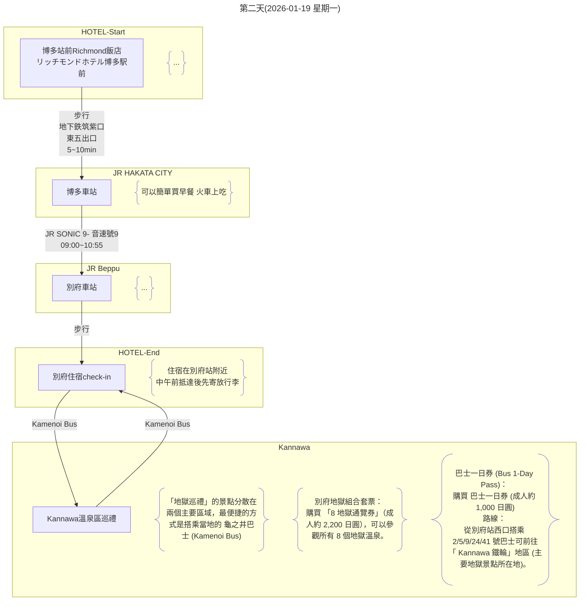
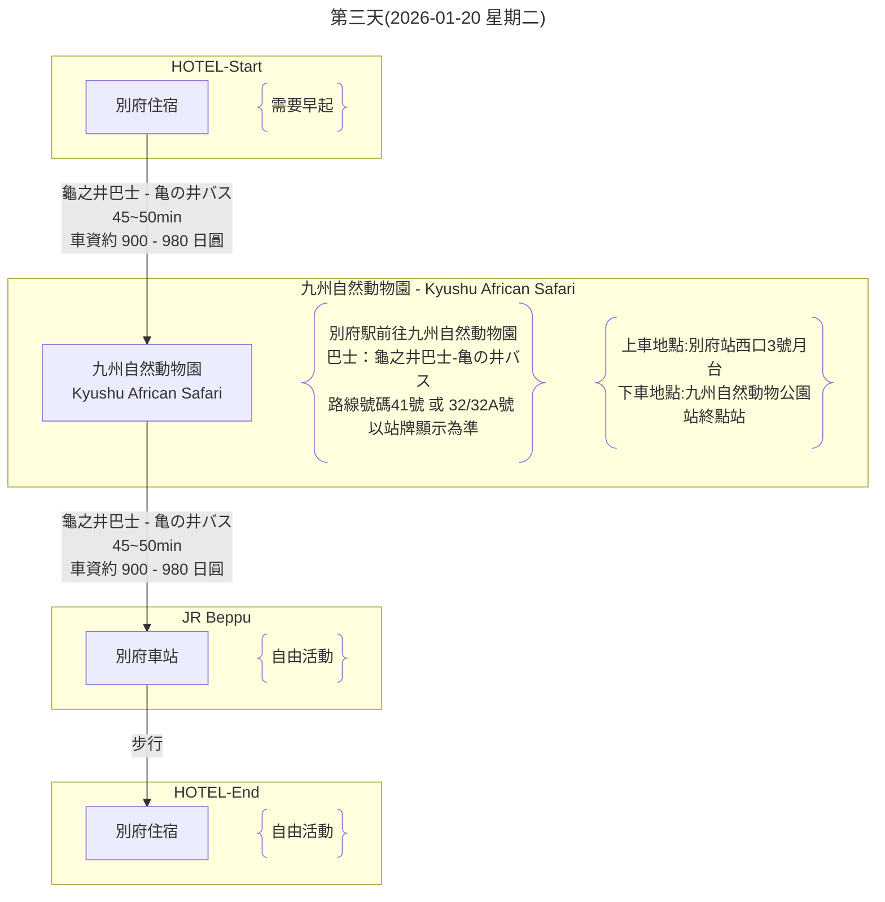
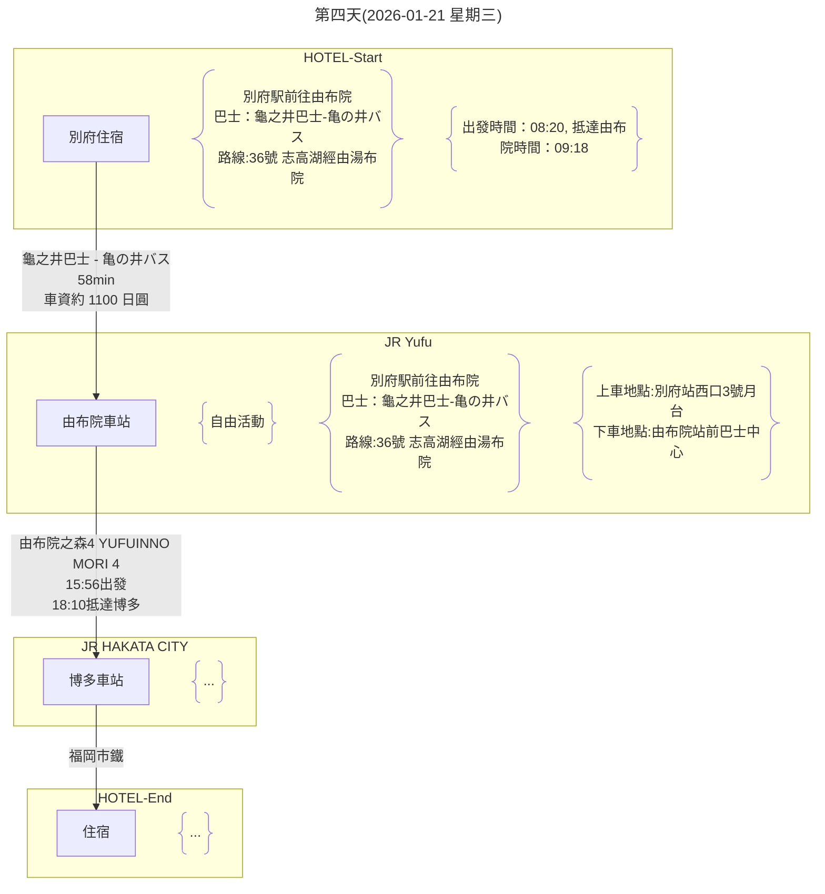

## 2.行程規劃

- [2.行程規劃](#2行程規劃)
  - [2.1 第一天(2026-01-18 星期日)](#21-第一天2026-01-18-星期日)
  - [2.2 第二天(2026-01-19 星期一)](#22-第二天2026-01-19-星期一)
  - [2.3 第三天(2026-01-20 星期二)](#23-第三天2026-01-20-星期二)
  - [2.4 第四天(2026-01-21 星期三)](#24-第四天2026-01-21-星期三)
  - [2.5 第五天(2026-01-22 星期四)](#25-第五天2026-01-22-星期四)
  - [2.6 第六天(2026-01-23 星期五)](#26-第六天2026-01-23-星期五)

[回到上層](./index.md)

---

***目前的行程規劃 尚未根據是否買JRPASS做優化調整***
**福岡市區的行程可以調整次序或調整安排**

### 2.1 第一天(2026-01-18 星期日)

**重點**
- 大約19:00福岡機場出關
- 抵達博多車站後 前往JR綠色櫃檯領取JR車票
- 在博多車站可以購買 FUKUOKA TOURIST CITY PASS，這是一種專為外國遊客設計的優惠票券，在福岡市區內無限次搭乘地鐵、公車和部分JR、西鐵電車。
  該票券可在博多車站的旅遊服務中心購買，並附帶多項景點的折扣優惠。
  另外，也有僅限巴士一日遊的「福岡市內1日乘車券」，但FUKUOKA TOURIST CITY PASS整合了更多交通工具的選擇。
  FUKUOKA TOURIST CITY PASS 購買地點：博多車站的旅遊資訊中心或綜合服務處。
  適用範圍：可在有效期間內不限次數搭乘福岡市內的地鐵、JR、西鐵巴士、西鐵電車（部分區段）等。
  票種：
  - 福岡市內版：成人 \(2,500\) 日圓，兒童 \(1,250\) 日圓。
  - 福岡市內+太宰府版：成人 \(2,800\) 日圓，兒童 \(1,400\) 日圓（不含太宰府Liner Bus「旅人」號）。
  優點：除交通外，還能享有部分觀光景點、餐廳和商店的專屬折扣。
  注意：購買時需要出示護照。
  其他票券選擇
  - 福岡市內1日乘車券：
    主要用於西鐵巴士一日無限搭乘，票價為成人 \(1,200\) 日圓。
    在西鐵天神高速、博多、福岡機場總站等處購買。
  - 福岡市地鐵1日乘車券：（**上次旅遊時購買此卷**）
    僅限福岡市地下鐵全線無限搭乘。成人票價為 \(640\) 日圓。 
- 飯店check in之後可返回博多車站美食街晚餐
  - 博多車站晚餐種類：
    - 拉麵： 麵屋兼虎 博多DEITOS店 （沾麵）
    - 牛腸鍋： 元祖牛腸鍋 樂天地 友都八喜博多站店 （在住宿附近但是很有名需要這個月先訂位看看）
    - google map 搜尋博多站 站內尋找（博多站大樓有兩到三家百貨公司共構 地下一樓有美食街跟伴手禮店 一樓大廳處也有鐵路便當可以當作買回飯店用餐的選擇 日本的便當都是冷的）

[回到頁首](#2行程規劃)

[回到上層](./index.md)

---

### 2.2 第二天(2026-01-19 星期一)

**重點**
- 早上一早從博多出發 早餐在音速號上吃
- 中午抵達別府先去旅館寄放行李（住宿別府站周邊旅館）
- 回到別府站購買巴士一日卷（或是不買 直接搭乘付費）前往溫泉區參觀 可以在別府站先用中餐
- 傍晚一樣搭巴士回別府旅館 用餐 旅館休憩 自由活動
- 本日行程以悠閒為主 可自由活動規劃想去的地方

[回到頁首](#2行程規劃)

[回到上層](./index.md)

---

### 2.3 第三天(2026-01-20 星期二)

**重點**
- 早上需要在八點半抵達動物園 才比較能夠買到早上的叢林巴士票
- 如果旅館有包車旅遊套餐的話可以考慮直接購買
- 其他時間為自由活動時間
- 方案比較與費用分析 (成人) (Google Gemini協助查詢)

  | 方案 | 票券內容 | 費用細節 (約) | **總計 (約)** |
  | :--- | :--- | :--- | :--- |
  | **A. 全部單程付費** | **交通：** 地獄來回 + 動物園來回 **門票：** 動物園入園 + 叢林巴士 | 地獄來回：780 日圓 動物園來回：1,960 日圓 動物園門票：3,900 日圓 (2,600+1,300) | **6,640 日圓** |
  | **B. 龜之井廣域 2 日券** | **交通：** 2日巴士無限搭乘 **門票：** 動物園入園 + 叢林巴士 | 廣域 2 日券：2,600 日圓 動物園門票：3,900 日圓 | **6,500 日圓** |
  | **C. 動物園套票 + 單程** | **Day 2：** 動物園交通套票 **Day 1：** 地獄單程付費 | 動物園交通套票：4,600 日圓 地獄來回：780 日圓 | **5,380 日圓** |

  - 所有費用皆為成人票價的估計值，實際價格請以當地最新公告為準。
  - 「動物園交通套票」約 4,600 日圓，包含了 Day 2 的所有交通和門票費用（往返巴士、入園費、叢林巴士）。
  - 此比較不包含地獄巡禮的門票費用（地獄共通觀覽券約 2,200 日圓）。

[回到頁首](#2行程規劃)

[回到上層](./index.md)

---

### 2.4 第四天(2026-01-21 星期三)

**重點**
- 本日主要為由布院散策
- 由布院之森觀光列車體驗
- 傍晚抵達博多車站 自由活動

[回到頁首](#2行程規劃)

[回到上層](./index.md)

---

### 2.5 第五天(2026-01-22 星期四)

**重點**
- 本日為市區觀光行程
- lalaport之後的行程依照喜好自行安排（應該是在中午餐後）

**額外資訊：**
- LaLaport 鋼彈立像：
  - 啟動表演 (白天)：10:00 開始，每個整點會有一次簡單的動作表演。
  - 燈光秀/影像秀 (夜晚)：19:00 開始，每隔 30 分鐘會有一次搭配燈光特效的特別演出。
- 博多運河城 水舞秀 (Canal Aqua Panorama)：
  - 白天：10:00~17:30，整點為音樂水舞秀，半點為純水舞秀。
  - 夜晚：18:00~22:00，整點和半點皆為音樂水舞秀，並結合光雕投影。
  - 鋼彈水舞秀：通常在 20:30 左右，一天僅一場 10 分鐘的結合鋼彈主題的特別表演。

[回到頁首](#2行程規劃)

[回到上層](./index.md)

---

### 2.6 第六天(2026-01-23 星期五)

**重點**
- 睡醒退房後的悠閒行程
- 下午五點前需要抵達福岡機場國際線大廳報到登機

[回到頁首](#2行程規劃)

[回到上層](./index.md)

---

